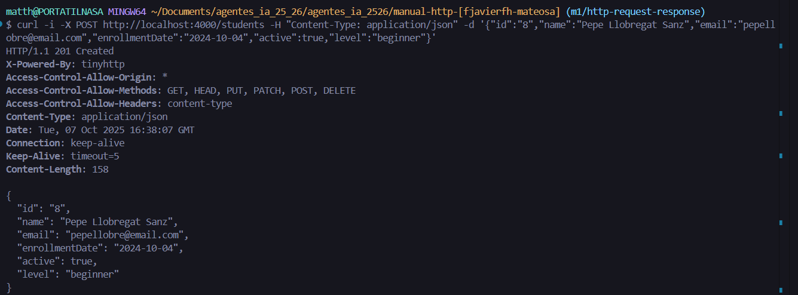

# Documentación operaciones CRUD

## Crear un estudiante con el comando POST
Se envía una solicitud de tipo POST al servidor para crear un nuevo estudiante con los datos proporcionados, que es un objeto y tiene que pasarse a tipo JSON. Si la solicitud tiene éxito, se añadirá un estudiante nuevo a la base de datos

### El comando es: 
```bash
    curl -i -X POST http://localhost:4000/students -H "Content-Type: application/json" -d '{"id":"8","name":"Pepe Llobregat Sanz","email":"pepellobre@email.com","enrollmentDate":"2024-10-04","active":true,"level":"beginner"}'
```

### El comando podemos dividirlo en varias secciones: 

curl: Se usa este comando para realizar peticiones HTTP.
Para ello se usan algunas flags:
    -i: Indica que debe mostrar los encabezados de la respuesta HTTP junto con un cuerpo.
    -X: Nos indica que debemos seleccionar un método CURL. Si no se incluyera esta flag, se usaría por defecto el método GET.
    -H: Permite añadir encabezados a nuestra solicitud. En este caso: "Content-Type: application/json" nos indica que el cuerpo de nuestra petición está en JSON.
    -d: Sirve para definir el cuerpo de la solicitud. Si usamos esta flag, el comando curl pasa a utilizar por defecto el método POST.
POST: Es el método que utilizaremos para esta petición, porque es el utilizado para añadir algo al servidor.
Se envía el header "Content-Type: application/json" porque es obligatorio ponerlo siempre que usamos un JSON.

### Respuesta real HTTP



### Explicación del código de estado HTTP:

Se envía un 201 por el -i y nos indica que el estudiante, en este caso, Pepe Llobregat Sanz, se ha creado correctamente con todos los datos que le hemos enviado.