# Documentación operaciones CRUD con CURL

## Crear un estudiante con el comando POST
Se envía una solicitud de tipo **POST** al servidor para crear un nuevo estudiante con los datos proporcionados, que es un objeto y tiene que pasarse a tipo JSON. Si la solicitud tiene éxito, se añadirá un estudiante nuevo a la base de datos

### El comando es: 
```bash
    curl -i -X POST http://localhost:4000/students -H "Content-Type: application/json" -d '{"id":"8","name":"Pepe Llobregat Sanz","email":"pepellobre@email.com","enrollmentDate":"2024-10-04","active":true,"level":"beginner"}'
```

### El comando podemos dividirlo en varias secciones: 

curl: Se usa este comando para realizar peticiones HTTP.
Para ello se usan algunas flags:
    -i: Indica que debe mostrar los encabezados de la respuesta HTTP junto con un cuerpo.
    -X: Nos indica que debemos seleccionar un método CURL. Si no se incluyera esta flag, se usaría por defecto el método GET.
    -H: Permite añadir encabezados a nuestra solicitud. En este caso: "Content-Type: application/json" nos indica que el cuerpo de nuestra petición está en JSON.
    -d: Sirve para definir el cuerpo de la solicitud. Si usamos esta flag, el comando curl pasa a utilizar por defecto el método POST.
POST: Es el método que utilizaremos para esta petición, porque es el utilizado para añadir algo al servidor.
Se envía el header "Content-Type: application/json" porque es obligatorio ponerlo siempre que usamos un JSON.

### Respuesta real HTTP

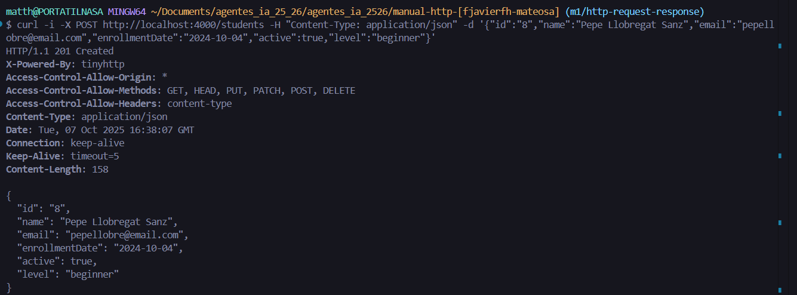

### Explicación del código de estado HTTP:

Se envía un **201** por el -i y nos indica que el estudiante, en este caso, Pepe Llobregat Sanz, se ha creado correctamente con todos los datos que le hemos enviado.

## Leer los datos de todos los estudiantes con el comando GET
Se envía una solicitud **GET** al endpoint /students para recuperar la lista completa de todos los estudiantes almacenados en la base de datos. Es una operación de lectura que no modifica el estado del servidor.

### El comando es: 
```bash
    curl -i -X GET http://localhost:4000/students
```

### El comando podemos dividirlo en varias secciones: 

curl: Se usa este comando para realizar peticiones HTTP.
Para ello se usan algunas flags:
    -i: Indica que debe mostrar los encabezados de la respuesta HTTP junto con un cuerpo.
    -X: Nos indica que debemos seleccionar un método CURL. Si no se incluyera esta flag, se usaría por defecto el método GET.
    -H: Permite añadir encabezados a nuestra solicitud. En este caso no hay encabezados ya que en la lectura no es necesario
    -d: Sirve para definir el cuerpo de la solicitud. Si usamos esta flag, el comando curl pasa a utilizar por defecto el método POST.
GET: Es el método que utilizaremos para esta petición, porque es el utilizado para recuperar datos que hay en el servidor. Es el por defecto del comando curl

### Respuesta real HTTP

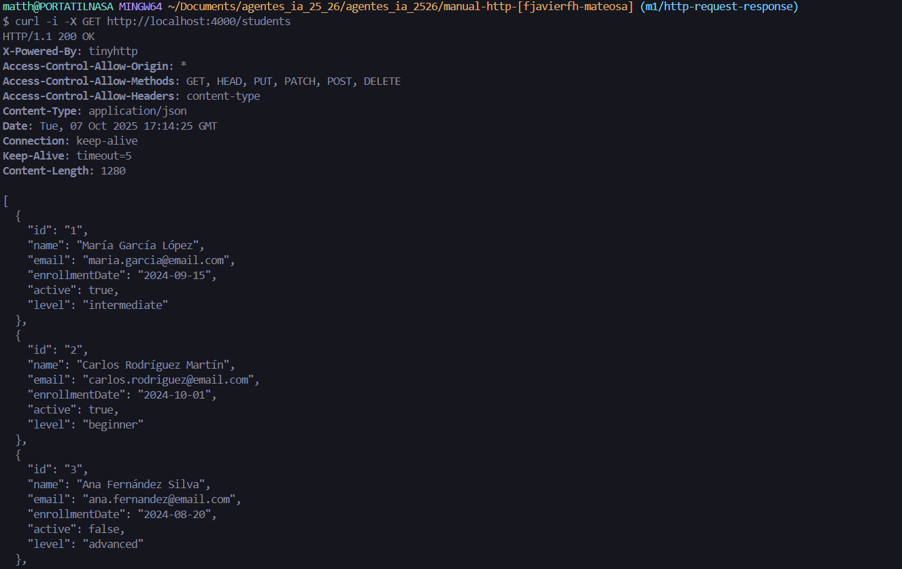
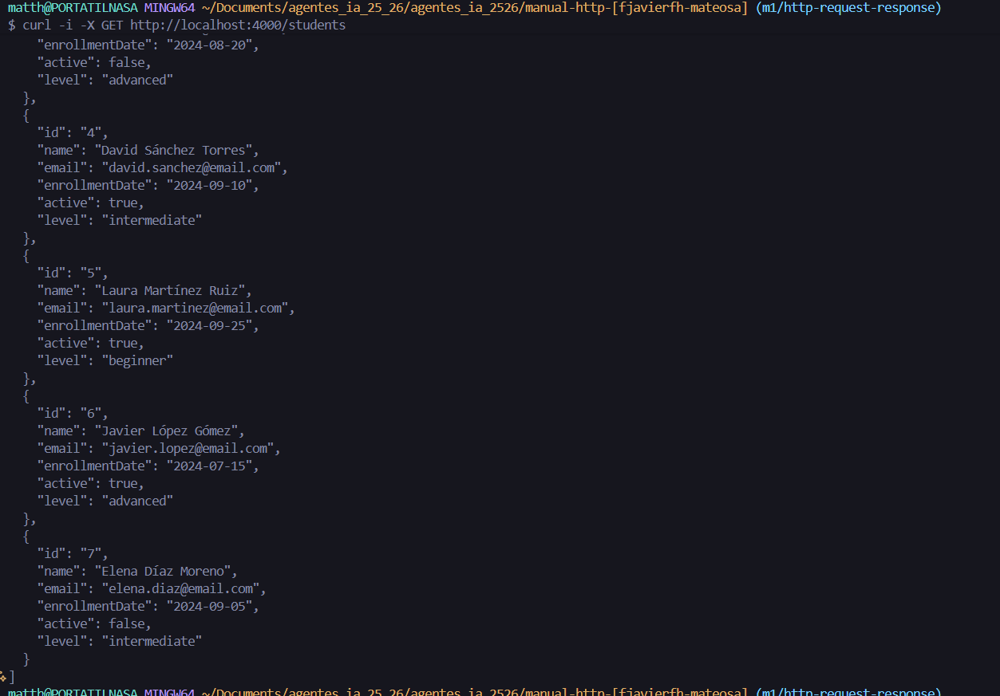


### Explicación del código de estado HTTP:

Se devuelve un código **200** y eso nos indica que todo ha funcionado y los datos existen, por eso se muestran en el cuerpo de la respuesta.

## Leer los datos de un solo estudiante con el comando GET
Se envía una solicitud **GET** al endpoint /students para recuperar los datos de un solo estudiante. Debemos proporcionar el ID de ese estudiante. Es una operación de lectura que no modifica el estado del servidor.

### El comando es: 
```bash
    curl -i -X GET http://localhost:4000/students/2
```

### El comando podemos dividirlo en varias secciones: 

curl: Se usa este comando para realizar peticiones HTTP.
Para ello se usan algunas flags:
    -i: Indica que debe mostrar los encabezados de la respuesta HTTP junto con un cuerpo.
    -X: Nos indica que debemos seleccionar un método CURL. Si no se incluyera esta flag, se usaría por defecto el método GET.
    -H: Permite añadir encabezados a nuestra solicitud. En este caso no hay encabezados ya que en la lectura no es necesario
    -d: Sirve para definir el cuerpo de la solicitud. Si usamos esta flag, el comando curl pasa a utilizar por defecto el método POST.
GET: Es el método que utilizaremos para esta petición, porque es el utilizado para recuperar datos que hay en el servidor. Es el por defecto del comando curl

http://localhost:4000/students/2 es el enlace que usaremos para realizar la operación. En este caso, al endpoint se le añade un 2 para especificar el id que queremos

### Respuesta real HTTP

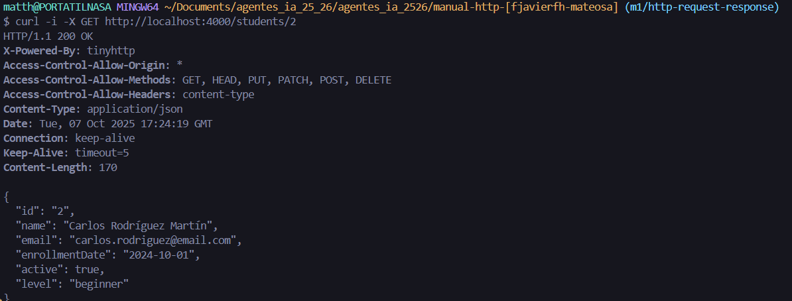


### Explicación del código de estado HTTP:

Se devuelve un código **200** y eso nos indica que todo ha funcionado y los datos existen, por eso se muestran en el cuerpo de la respuesta.

## Actualizar todos los campos de un estudiante con el comando PUT
Se envía una solicitud **PUT** la cual nos permitirá modificar un estudiante existente por completo.

### El comando es: 
```bash
    curl -i -X PUT http://localhost:4000/students/8 -H "Content-Type: application/json" -d '{"id":"8","name":"Pepe Llobregat Sanz","email":"pepellobre@email.com","enrollmentDate":"2024-10-04","active":true,"level":"intermediate"}'
```

### El comando podemos dividirlo en varias secciones: 

curl: Se usa este comando para realizar peticiones HTTP.
Para ello se usan algunas flags:
    -i: Indica que debe mostrar los encabezados de la respuesta HTTP junto con un cuerpo.
    -X: Nos indica que debemos seleccionar un método CURL. Si no se incluyera esta flag, se usaría por defecto el método GET.
    -H: Permite añadir encabezados a nuestra solicitud. En este caso: "Content-Type: application/json" nos indica que el cuerpo de nuestra petición está en JSON.
    -d: Sirve para definir el cuerpo de la solicitud. Si usamos esta flag, el comando curl pasa a utilizar por defecto el método POST, lo que requiere el flag -X si se quiere usar otro método curl. El cuerpo que le pasamos es el de un estudiante existente para poder modificarlo.
PUT: Es el método que utilizaremos para esta petición, porque nos permite modificar por completo un objeto que le pasemos como parámetro.


### Respuesta real HTTP

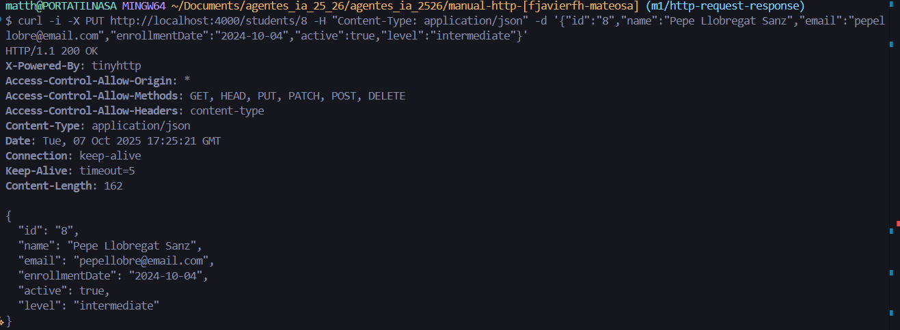


### Explicación del código de estado HTTP:

Se devuelve un código **200** y eso nos indica que todo ha funcionado y el estudiante ha sido modificado.

## Actualizar un campo de un estudiante con el comando PATCH

Se envía una solicitud **PATCH** al endpoint /students con el id del estudiante que queremos modificar parcialmente. Para ello, necesitaremos el id de ese estudiante y algunos de los campos que deseemos.

### El comando es: 
```bash
    curl -i -X PATCH http://localhost:4000/students/8 -H "Content-Type: application/json" -d '{"active":false}'
```

### El comando podemos dividirlo en varias secciones: 

curl: Se usa este comando para realizar peticiones HTTP.
Para ello se usan algunas flags:
    -i: Indica que debe mostrar los encabezados de la respuesta HTTP junto con un cuerpo.
    -X: Nos indica que debemos seleccionar un método CURL. Si no se incluyera esta flag, se usaría por defecto el método GET.
    -H: Permite añadir encabezados a nuestra solicitud. En este caso: "Content-Type: application/json" nos indica que el cuerpo de nuestra petición está en JSON.
    -d: Sirve para definir el cuerpo de la solicitud. Si usamos esta flag, el comando curl pasa a utilizar por defecto el método POST, lo que requiere el flag -X si se quiere usar otro método curl. El cuerpo que le pasamos es el de un estudiante existente para poder modificarlo.
PATCH: Es el método que utilizaremos para esta petición, porque nos permite modificar los campos de un objeto que le pasemos como parámetro.


### Respuesta real HTTP

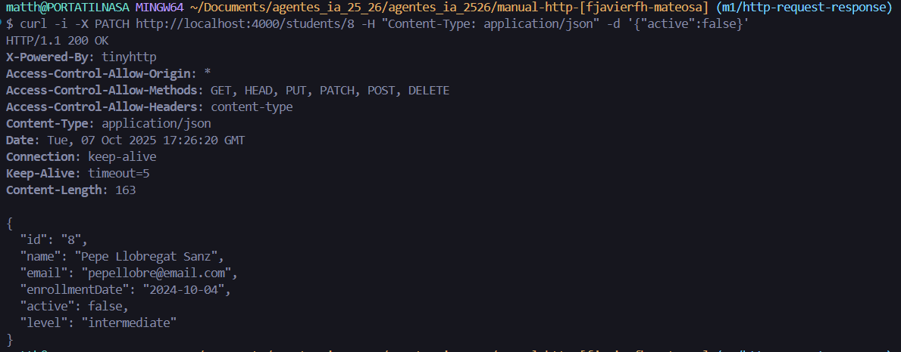


### Explicación del código de estado HTTP:

Se devuelve un código **200** y eso nos indica que todo ha funcionado y el estudiante ha sido modificado en los campos seleccionados.

## Eliminar un estudiante con el comando DELETE

Se envía una solicitud **DELETE** al endpoint /students con el id del estudiante que queremos eliminar.

### El comando es: 
```bash
    curl -i -X DELETE http://localhost:4000/students/8
```

### El comando podemos dividirlo en varias secciones: 

curl: Se usa este comando para realizar peticiones HTTP.
Para ello se usan algunas flags:
    -i: Indica que debe mostrar los encabezados de la respuesta HTTP junto con un cuerpo, lo que nos permite revisar el código de estado.
    -X: Nos indica que debemos seleccionar un método CURL. Si no se incluyera esta flag, se usaría por defecto el método GET.
    -H: Permite añadir encabezados a nuestra solicitud. En este caso no se pone ningún encabezado, dado que no 
    -d: Sirve para definir el cuerpo de la solicitud. Si usamos esta flag, el comando curl pasa a utilizar por defecto el método POST, lo que requiere el flag -X si se quiere usar otro método curl. El cuerpo que le pasamos es el de un estudiante existente para poder modificarlo.
DELETE: Es el método que utilizaremos para esta petición, porque nos permite eliminar permanentemente un estudiante dado un id que se pasa como parámetro.

### Respuesta real HTTP

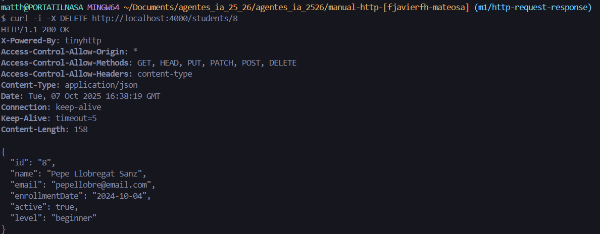


### Explicación del código de estado HTTP:

Se devuelve un código 200 y eso nos indica que todo ha funcionado y el estudiante ha sido eliminado con éxito de la base de datos.


## CAPTURAS DE LA EJECUCIÓN DEL SCRIPT CRUD:CURL

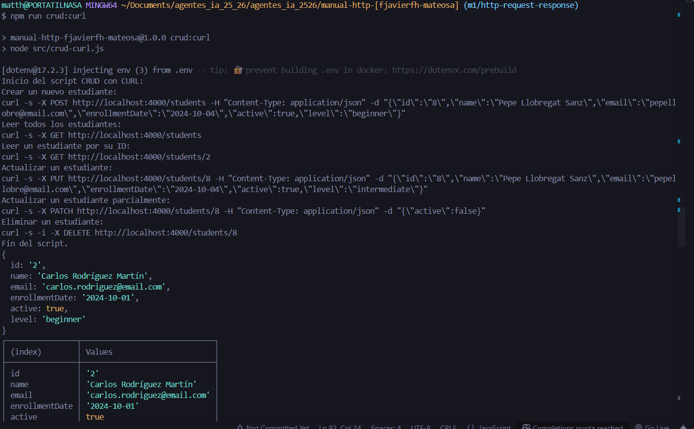
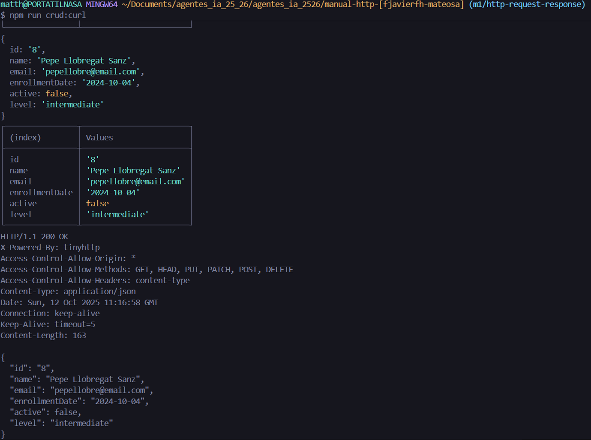
Podemos apreciar como al principio de la consola aparece el siguiente comando:
```bash
    npm run crud:curl
```
El cual nos muestra el comando a ejecutar y el resultado que genera.

# Documentacion de operaciones CRUD con Thunder Client

## Peticiones en Thunder Client

En Thunder Client se deben crear las siguientes peticiones:

- **CREATE Student (POST)**
- **GET All Students (GET)**
- **GET Student by ID (GET)**
- **UPDATE Student (PUT)**
- **PATCH Student (PATCH)**
- **DELETE Student (DELETE)**

### Pasos para crearlas

1. Abre **Thunder Client** desde Visual Studio Code.  
2. Pulsa en **New Request**.  
3. Selecciona el metodo HTTP correspondiente (POST, GET, PUT, PATCH o DELETE).  
4. Escribe la URL de tu API (por ejemplo: `http://localhost:4000/students`).  
5. En las peticiones que lo necesiten, selecciona la pestaña **Body**, elige **JSON**, e introduce los datos correspondientes.  
6. Pulsa **Send** para ejecutar la peticion.  

---

## CREATE Student (POST)

Crea un nuevo estudiante en la base de datos.

**Metodo:** POST  
**URL:** `http://localhost:4000/students`  

**Body (JSON):**
```json
{
    "id": "20",
    "name": "Mateo Garcia Contreras",
    "email": "mateo.garcia@email.com",
    "enrollmentDate": "2025-09-15",
    "active": false,
    "level": "advanced"
}
```

**Captura:**  
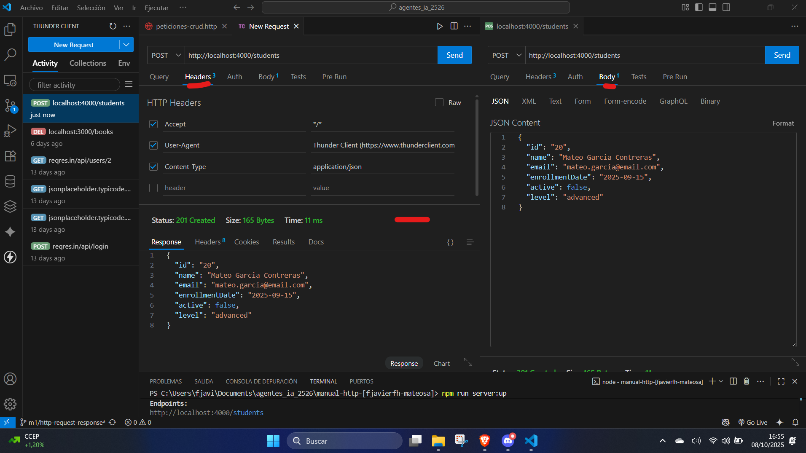

---

## GET All Students (GET)

Obtiene la lista completa de estudiantes.

**Metodo:** GET  
**URL:** `http://localhost:4000/students`  

**Captura:**  
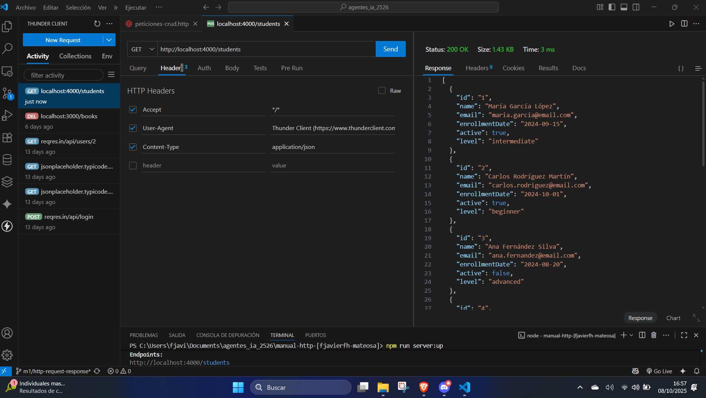

---

## GET Student by ID (GET)

Obtiene la informacion de un estudiante especifico segun su ID.

**Metodo:** GET  
**URL:** `http://localhost:4000/students/5`  

**Captura:**  
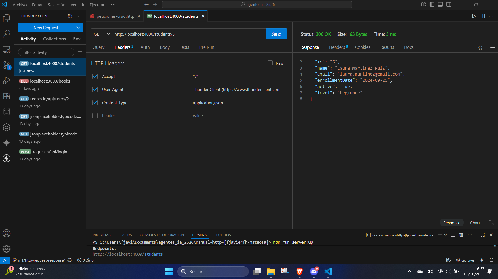

---

## UPDATE Student (PUT)

Actualiza completamente la informacion de un estudiante existente.

**Metodo:** PUT  
**URL:** `http://localhost:4000/students/20`  

**Body (JSON):**
```json
{
    "id": "20",
    "name": "Carlos Rodriguez Martin",
    "email": "carlos.rodriguez@email.com",
    "enrollmentDate": "2024-10-01",
    "active": false,
    "level": "beginner"
}
```

**Captura:**  
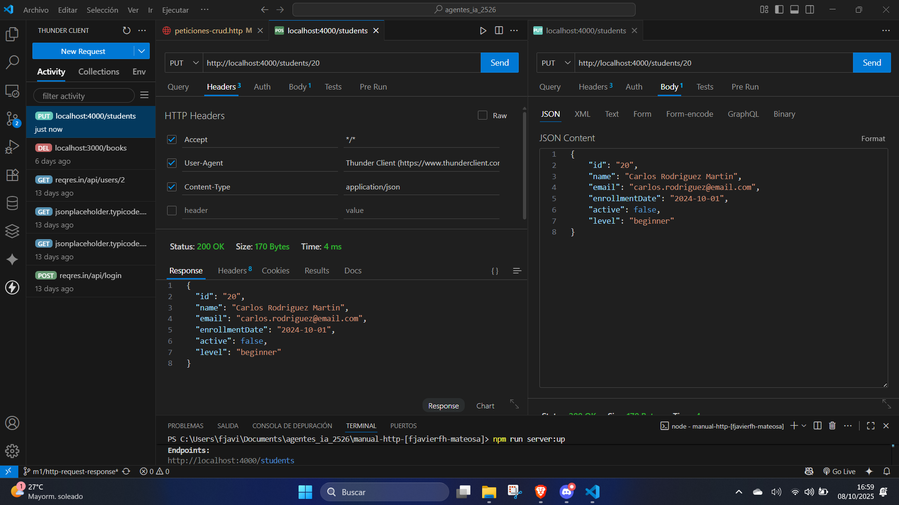

---

## PATCH Student (PATCH)

Modifica parcialmente los datos de un estudiante.

**Metodo:** PATCH  
**URL:** `http://localhost:4000/students/20`  

**Body (JSON):**
```json
{
    "active": true
}
```

**Captura:**  
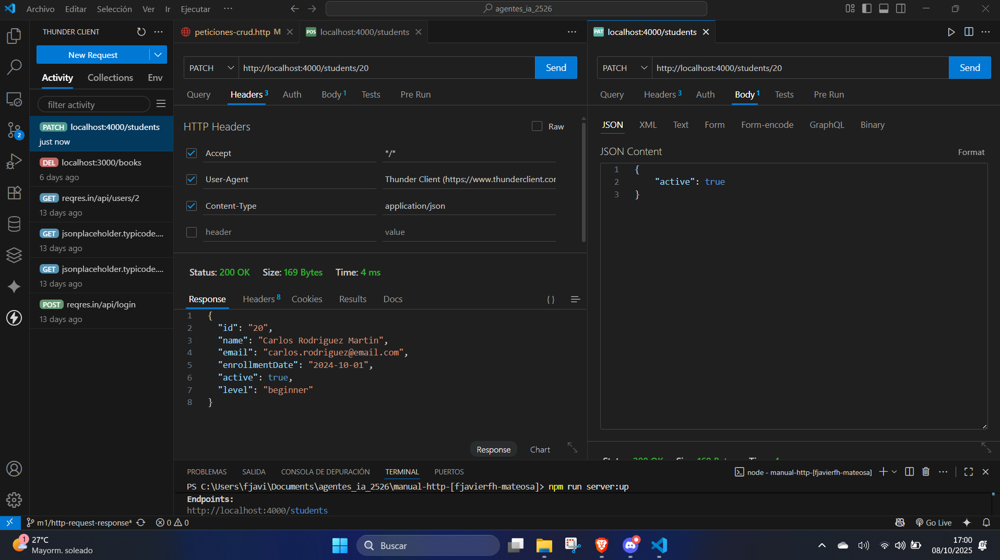

---

## DELETE Student (DELETE)

Elimina un estudiante por su ID.

**Metodo:** DELETE  
**URL:** `http://localhost:4000/students/20`  

**Captura:**  
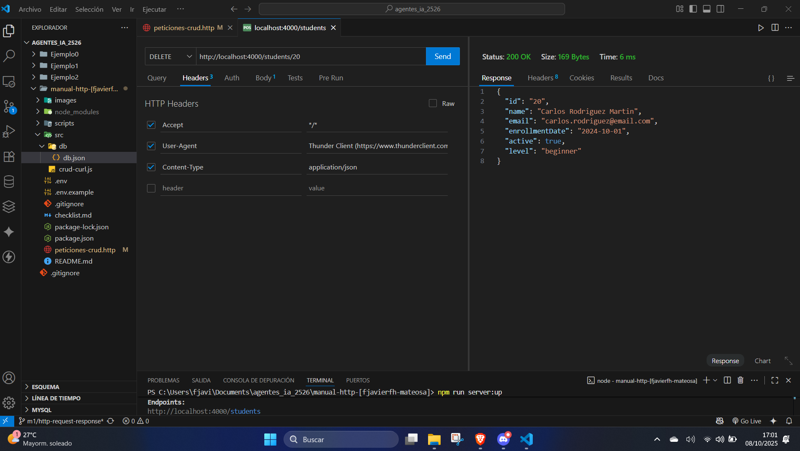


# Uso de REST API con Operaciones CRUD

A continuacion se muestran ejemplos practicos del uso de una **REST API** para realizar operaciones **CRUD** (Create, Read, Update, Delete) utilizando variables de entorno para hacer las peticiones mas flexibles y reutilizables.

---

## Variables de entorno

Estas variables se definen al inicio del archivo `peticiones-crud.http` para facilitar la configuracion de las peticiones:

```http
@baseUrl = http://example.com
@port = 4000
@apiUrl = {{baseUrl}}:{{port}}
@contentType = application/json
@idPrueba = idParaPruebas
```

**Descripcion de cada variable:**
- **@baseUrl:** Direccion base del servidor donde se aloja la API.  
- **@port:** Puerto en el que escucha la API.  
- **@apiUrl:** URL completa generada a partir de las dos anteriores.  
- **@contentType:** Tipo de contenido que se enviara (JSON en este caso).  
- **@idPrueba:** ID que usaremos para las pruebas de los endpoints.

---

## 1. Crear estudiante (CREATE)

### Metodo: `POST`

Ejemplo de peticion para crear un nuevo estudiante.  
Se especifica el metodo `POST`, la URL base y el cuerpo en formato JSON.

```http
POST {{apiUrl}}/students
Content-Type: {{contentType}}

{
    "id": "{{idPrueba}}",
    "name": "Mateo Garcia Contreras",
    "email": "mateo.garcia@email.com",
    "enrollmentDate": "2025-09-15",
    "active": false,
    "level": "advanced"
}
```

**Descripcion:**  
Esta peticion agrega un nuevo estudiante con los datos indicados.  
El servidor deberia devolver un codigo de estado **201 (Created)** y el objeto del estudiante creado.

**Captura:**  
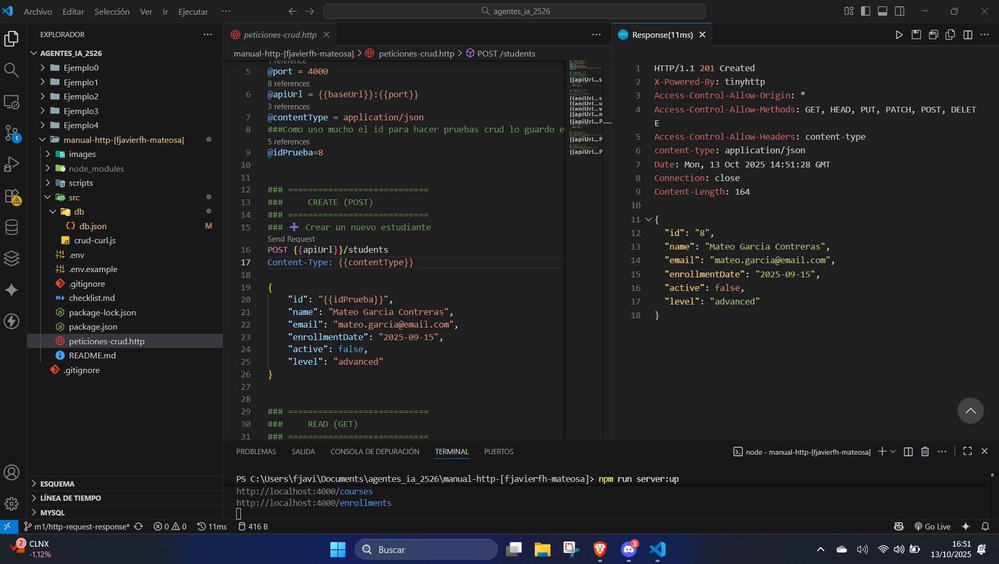

---

## 2. Actualizar estudiante (UPDATE)

### Metodo: `PUT`

Ejemplo de peticion para actualizar la informacion de un estudiante existente, usando su ID como parametro en la URL.

```http
PUT {{apiUrl}}/students/{{idPrueba}}
Content-Type: {{contentType}}

{
    "id": "{{idPrueba}}",
    "name": "Carlos Rodriguez Martin",
    "email": "carlos.rodriguez@email.com",
    "enrollmentDate": "2024-10-01",
    "active": false,
    "level": "beginner"
}
```

**Descripcion:**  
Esta peticion modifica los datos del estudiante identificado por `idPrueba`.  
El servidor deberia devolver un codigo **200 (OK)** y el objeto actualizado.

**Captura:**  
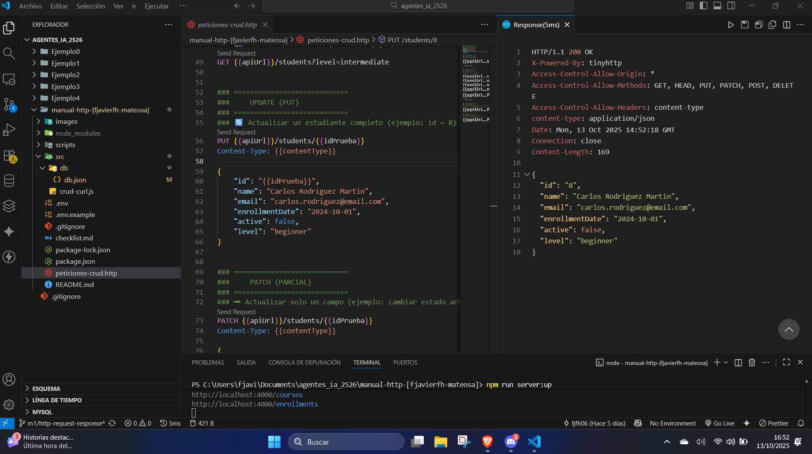